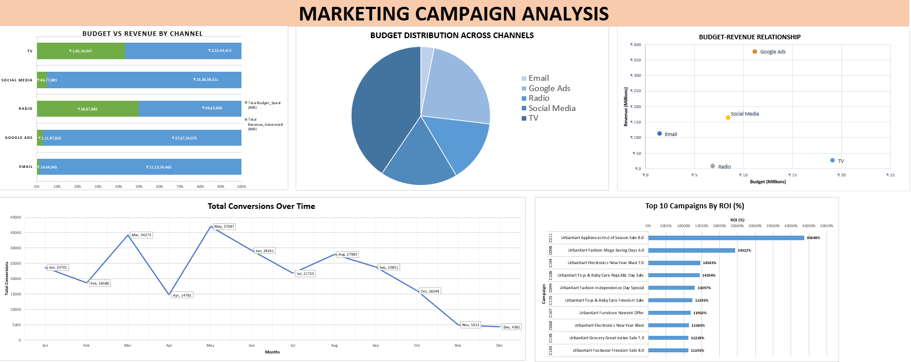

# UrbanKart Marketing Campaign Performance Analysis (Excel)

An end-to-end Excel analysis of one year of marketing campaign data for **UrbanKart**, a fictional Indian e-commerce company, covering 220 campaigns across 5 marketing channels (Email, Google Ads, Social Media, TV, Radio). The goal: figure out which channels actually generate a return, which campaigns are bleeding money, and where budget should move.

This project was built entirely in Excel — from raw, messy data to a fully cleaned dataset, calculated metrics, PivotTables, and charts — to demonstrate practical, job-ready Excel skills for data analysis.

---

## 📁 Files in this repo

| File | Description |
|---|---|
| `Marketing_Campaign_Raw_Data.csv` | Raw, uncleaned source data (220 rows, 10 columns) |
| `Marketing_Campaign_Cleaned_Data.xlsx` | Full Excel workbook — cleaned data, formulas, PivotTables, and charts |
| `Marketing_Campaign_Analysis.pdf` | Write-up of the full analysis and business recommendations |

---

## 🗂 Dataset

- **220 campaign records**, 10 original columns
- **5 channels**: Email, Google Ads, Social Media, TV, Radio
- Columns: Campaign ID, Campaign Name, Channel, Start/End Date, Budget Spent (INR), Impressions, Clicks, Conversions, Revenue Generated (INR)
- 10 of 220 rows had at least one missing value (across Impressions, Clicks, Conversions, and Revenue)

---

## 🧹 Data Cleaning (Excel)

- Converted `Start Date` / `End Date` from text to proper date values and derived a **Duration (Days)** column
- Identified and handled missing values using **formula-driven imputation** rather than deleting rows:
  - Missing **Impressions/Clicks** → backed out using each channel's average CTR (`Impressions = Clicks / Avg CTR`, `Clicks = Impressions × Avg CTR`)
  - Missing **Conversions** → estimated using each channel's average Conversion Rate (`Clicks × Avg Conversion Rate`)
  - Missing **Revenue** (4 rows) → intentionally **left blank** rather than guessed, since revenue has no stable ratio to spend/clicks and estimating it would distort ROI. Dependent ROI/Profit-Loss cells were left blank too, to avoid silently corrupting downstream totals.
- Applied a **3-color coding system** across the sheet so every touched cell is auditable at a glance:
  - 🔴 Red — negative ROI / loss-making campaign
  - 🟡 Yellow — missing value that was calculated/estimated from other fields
  - ⬜ Grey — missing value that could not be estimated, left blank
- No duplicate Campaign IDs and no date/currency formatting issues were found during validation

## 🧮 Calculated Metrics (Formulas)

Six new metrics were built with Excel formulas on top of the raw fields:

| Metric | Formula |
|---|---|
| Duration (Days) | `End Date − Start Date` |
| CTR (%) | `Clicks / Impressions` |
| Conversion Rate (%) | `Conversions / Clicks` |
| Cost Per Click | `Budget Spent / Clicks` |
| Cost Per Conversion | `Budget Spent / Conversions` |
| ROI (%) | `(Revenue − Budget Spent) / Budget Spent × 100` |
| Profit/Loss | `Revenue − Budget Spent` |

> **Note on ROI:** the `ROI (%)` cells in the workbook currently store `(Revenue − Budget) / Budget` *without* the `× 100` multiplication, even though the column is labeled as a percentage. All ROI figures below have been corrected by multiplying the sheet's raw values by 100 to reflect the formula as documented. Rankings and relative comparisons are unaffected — only the absolute percentages change.

## 📊 PivotTables & Charts

Built a separate PivotTable and visualization layer on top of the cleaned data:

- **Campaigns ranked by ROI (%)** and **by Cost Per Conversion** — surfaces best and worst individual campaigns
- **Channel-level rollup**: Budget, Revenue, Total Impressions/Clicks/Conversions, Average CTR, Average Conversion Rate, Average CPC, Average CPA, Average ROI, Overall ROI, Average Profit/Loss — one summary table per channel
- **Channel Rank by Overall ROI** — a standalone ranked table
- **Monthly conversions trend** (Jan–Dec) via a PivotTable grouped by month
- **Charts built from the PivotTables**:
  - 100%-stacked bar — Budget vs. Revenue share by channel
  - Clustered bar — Budget distribution across channels
  - Pie chart — Budget distribution across channels
  - Line chart — Conversions over time (monthly trend)
  - Scatter chart — Budget vs. Revenue by channel (with data labels)

*Google Ads and TV pull in the largest budgets, but revenue tells a different story — Google Ads converts that spend into by far the most revenue, while TV's revenue barely clears its budget line.*

---

## 🔍 Key Insights

**Email is the best-performing channel by far.**
Email delivers the highest ROI (**7,504% overall**, 8,079% average per campaign) despite getting only ~3% of total budget. It's also the cheapest channel to run — lowest cost per click (₹2.44), lowest cost per conversion (₹44.58) — and has the highest CTR (4.3%). Google Ads edges it out on conversion rate (7.8% vs. Email's 6.0%), but Email's rock-bottom cost base is what drives its outsized ROI.

**29 campaigns are running at a loss — every single one is TV or Radio.**
18 of 40 TV campaigns and 11 of 16 Radio campaigns are loss-making. Not one Email, Google Ads, or Social Media campaign lost money. The worst-performing campaigns on cost per conversion — a TV campaign and a Social Media campaign tied at ₹7,104 per conversion — cost roughly 160× Email's average cost per conversion.

**TV gets the biggest budget but the second-worst ROI.**
TV absorbs ~40% of total spend and generates 26.5 crore impressions, but that reach barely converts — Overall ROI is just 32.5%, second-lowest after Radio (0.9%). High visibility ≠ high return.

**Budget allocation doesn't match performance.**
Google Ads is the single biggest revenue driver (₹37.7 Cr) with a strong 3,264% ROI, while Email — the best ROI performer of all — is starved of budget.

**Data quality flags worth investigating before trusting totals:**
- Campaign C211 posted an outlier 43,648% ROI, well clear of the next-best campaign (24,322%)
- 4 campaigns have no recorded revenue at all — a gap worth chasing upstream before it's factored into channel totals

---

## ✅ Business Recommendations

1. **Increase Email's budget** — best ROI in the dataset, currently the smallest allocation
2. **Keep scaling Google Ads** — largest revenue driver with the best conversion rate and a strong ROI
3. **Cut the 29 loss-making TV and Radio campaigns**
4. **Reduce overall TV and Radio spend** and reinvest the freed budget into Email and Google Ads
5. **Investigate the C211 outlier and the 4 missing-revenue campaigns** before relying on totals that include them

---

## 🛠 Skills Demonstrated

- Data cleaning & validation (missing values, formatting, duplicates)
- Formula-based data imputation (ratio/rate-based estimation instead of arbitrary fills)
- Conditional formatting for visual auditability (color-coded flagging)
- Formula design: date math, ratios, ROI/profitability calculations
- PivotTables: grouping, multi-metric rollups, ranking, time-based grouping
- Chart selection matched to the question (composition → pie/stacked bar, trend → line, relationship → scatter)
- Turning raw numbers into a clear business narrative — best/worst performers, budget misallocation, and concrete action items

---

📄 Full write-up with methodology and detailed findings: [`Marketing_Campaign_Analysis.pdf`](./Marketing_Campaign_Analysis.pdf)
